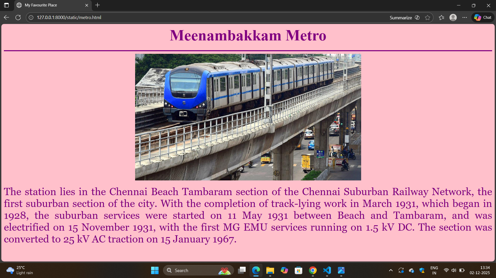
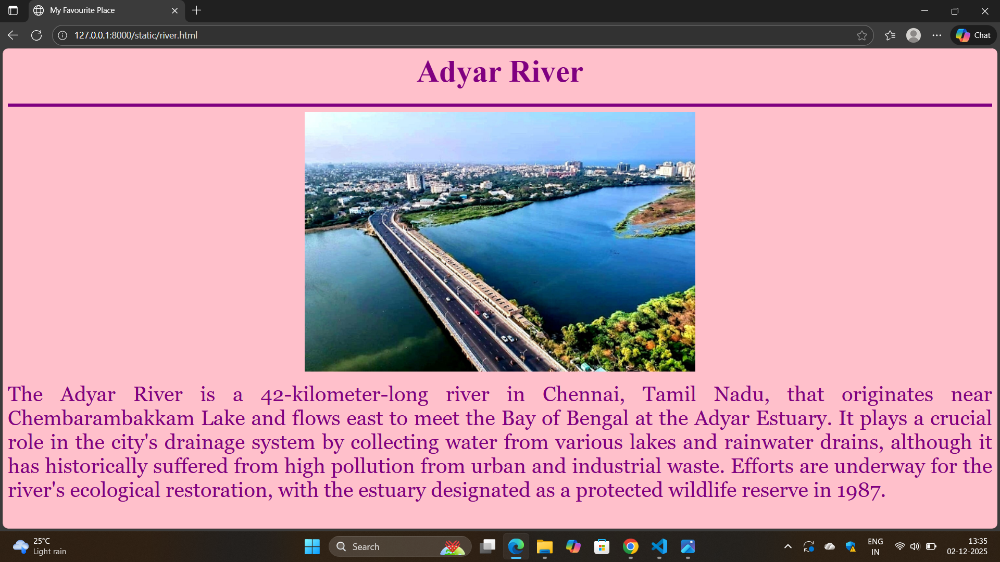
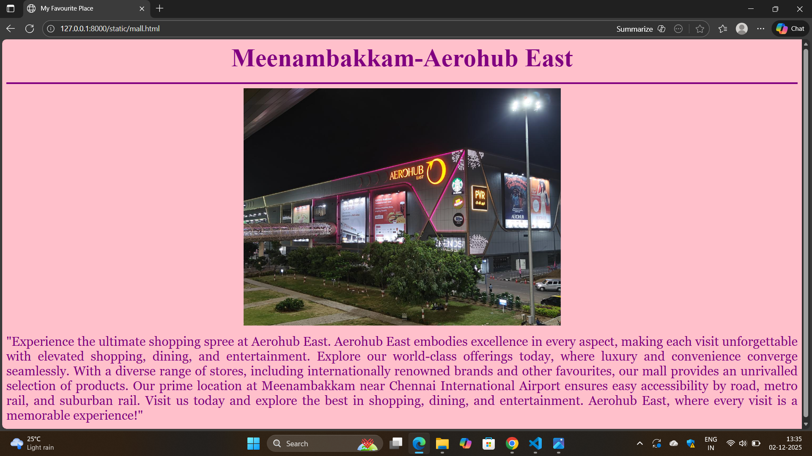
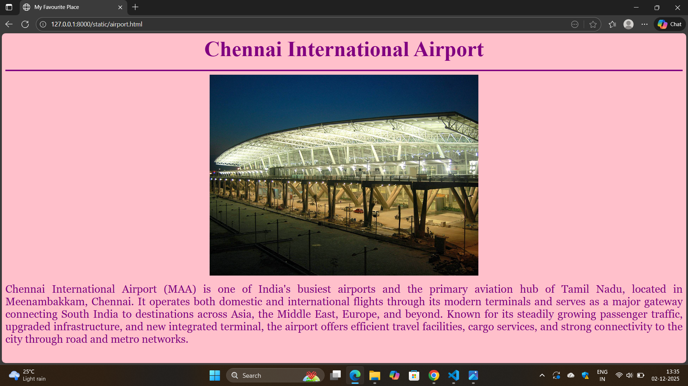
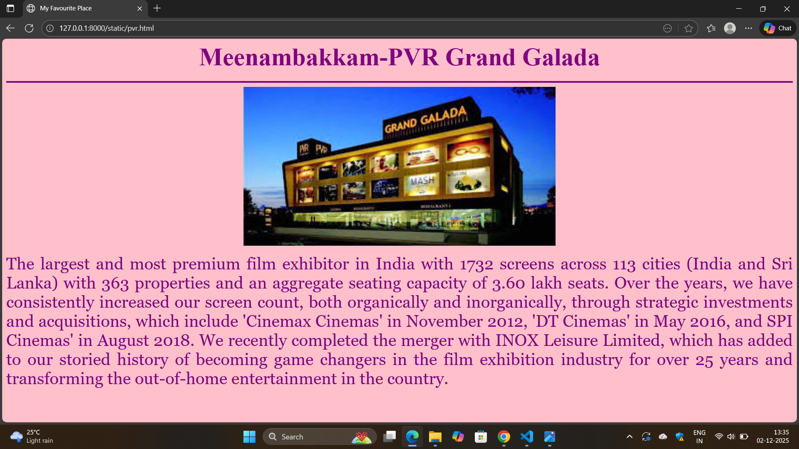

# Ex03 Places Around Me
# Date:01.12.2025
# AIM
To develop a website to display details about the places around my house.

# DESIGN STEPS
## STEP 1
Create a Django admin interface.

## STEP 2
Download your city map from Google.

## STEP 3
Using <map> tag name the map.

## STEP 4
Create clickable regions in the image using <area> tag.

## STEP 5
Write HTML programs for all the regions identified.

## STEP 6
Execute the programs and publish them.

# CODE
```
map.html:
<html>
    <head>
        <title>My City</title>
    </head>
<body>
<h1 align="center">
<font color ="red"><b>Meenambakkam</b></font>   
</h1>
<h3 align="center">
<font color="blue"><b>Logitha L</b></font>
</h3>
<center>

<map name="MyCity">
    <area target="" alt="Chennai International Airport" title="Chennai International Airport" href="airport.html" coords="890,233,774,52" shape="rect">
    <area target="" alt="Aerohub East" title="Aerohub East" href="mall.html" coords="711,547,74" shape="circle">
    <area target="" alt="PVR Grand Galada" title="PVR Grand Galada" href="pvr.html" coords="433,670,108" shape="circle">
    <area target="" alt="Meenambakkam Metro" title="Meenambakkam Metro" href="metro.html" coords="914,454,106" shape="circle">
    <area target="" alt="Adyar RIver" title="Adyar RIver" href="river.html" coords="110,100,56" shape="circle">
       
</map>
</center>
</body>
</html>

```
```
metro.html
<html>
    <head>
        <title>My Favourite Place</title>
    </head>
    <body bgcolor="pink">

    <h3 align="center">
    <font color="purple" size="7"><b>Meenambakkam Metro</b></font>
    </h3>
    <hr size="3" color="purple">
    <center>
        
    </center>
    <p align="justify">
    <font face="Georgia" size="6" color="purple">
    The station lies in the Chennai Beach Tambaram section of the Chennai Suburban Railway Network, the first suburban section of the city. With the completion of track-lying work in March 1931, which began in 1928, the suburban services were started on 11 May 1931 between Beach and Tambaram, and was electrified on 15 November 1931, with the first MG EMU services running on 1.5 kV DC. The section was converted to 25 kV AC traction on 15 January 1967.
    </font>
    </p>
    </body>
</html>
```

```
river.html
<html>
    <head>
        <title>My Favourite Place</title>
    </head>
    <body bgcolor="pink">

    <h1 align="center">
    <font color="purple" size="7"><b>Adyar River</b></font>
    </h1>
    <hr size="5" color="purple">
    <center>
    </center>
    <p align="justify">
    <font face="Georgia" size="6" color="purple">
    The Adyar River is a 42-kilometer-long river in Chennai, Tamil Nadu, that originates near Chembarambakkam Lake and flows east to meet the Bay of Bengal at the Adyar Estuary. It plays a crucial role in the city's drainage system by collecting water from various lakes and rainwater drains, although it has historically suffered from high pollution from urban and industrial waste. Efforts are underway for the river's ecological restoration, with the estuary designated as a protected wildlife reserve in 1987. 
    </font>
    </p>
    </body>
</html>
```
```
mall.html:
<html>
    <head>
        <title>My Favourite Place</title>
    </head>
    <body bgcolor="pink">
    
    <h3 align="center">
    <font color="purple" size="7"><b>Meenambakkam-Aerohub East</b></font>
    </h3>
    <hr size="3" color="purple">
    <center>
     
    </center>
    <p align="justify">
    <font face="Georgia" size="5" color="purple">
    "Experience the ultimate shopping spree at Aerohub East. Aerohub East embodies excellence in every aspect, making each visit unforgettable with elevated shopping, dining, and entertainment. Explore our world-class offerings today, where luxury and convenience converge seamlessly. With a diverse range of stores, including internationally renowned brands and other favourites, our mall provides an unrivalled selection of products. Our prime location at Meenambakkam near Chennai International Airport ensures easy accessibility by road, metro rail, and suburban rail. Visit us today and explore the best in shopping, dining, and entertainment. Aerohub East, where every visit is a memorable experience!"
    </font>
    </p>
    </body>
</html>
```
```
airport.html:
<html>
    <head>
        <title>My Favourite Place</title>
    </head>
    <body bgcolor="pink">
    
    <h3 align="center">
    <font color="purple" size="7"><b>Chennai International Airport</b></font>
    </h3>
    <hr size="3" color="purple">
    <center>
        
    </center>
    <p align="justify">
    <font face="Georgia" size="5" color="purple">
    Chennai International Airport (MAA) is one of India's busiest airports and the primary aviation hub of Tamil Nadu, located in Meenambakkam, Chennai. It operates both domestic and international flights through its modern terminals and serves as a major gateway connecting South India to destinations across Asia, the Middle East, Europe, and beyond. Known for its steadily growing passenger traffic, upgraded infrastructure, and new integrated terminal, the airport offers efficient travel facilities, cargo services, and strong connectivity to the city through road and metro networks.
    </font>
    </p>
    </body>
</html>
```
```
pvr.html:
<html>
    <head>
        <title>My Favourite Place</title>
    </head>
    <body bgcolor="pink">

    <h3 align="center">
    <font color="purple" size="7"><b>Meenambakkam-PVR Grand Galada</b></font>
    </h3>
    <hr size="3" color="purple">
    <center>
        
    </center>
    <p align="justify">
    <font face="Georgia" size="6" color="purple">
    The largest and most premium film exhibitor in India with 1732 screens across 113 cities (India and Sri Lanka) with 363 properties and an aggregate seating capacity of 3.60 lakh seats. Over the years, we have consistently increased our screen count, both organically and inorganically, through strategic investments and acquisitions, which include 'Cinemax Cinemas' in November 2012, 'DT Cinemas' in May 2016, and SPI Cinemas' in August 2018. We recently completed the merger with INOX Leisure Limited, which has added to our storied history of becoming game changers in the film exhibition industry for over 25 years and transforming the out-of-home entertainment in the country.
    </font>
    </p>
    </body>
</html>
```
# OUTPUT








# RESULT
The program for implementing image maps using HTML is executed successfully.
